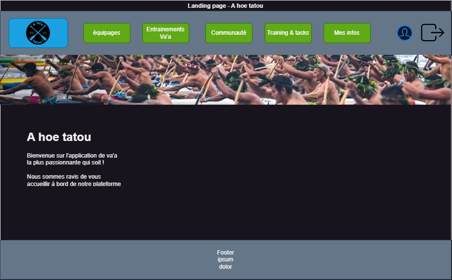
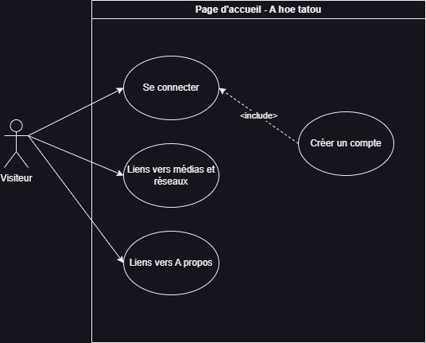
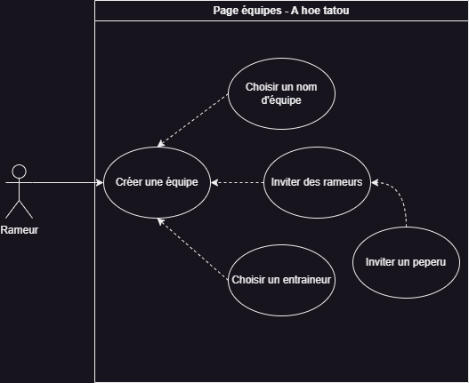

# Project L3 - Proof of Concept - Documentation

## Va'a Training Tracking Application - A Hoe Tatou
**Client: Va'a Team Coach**  
**Delivery Date:** UNDETERMINED  
**@author :** Vaanaiki BROTHERSON aka Naiki  
**@date :** September 2023
### Links
**@github :** https://github.com/naikibro/a-hoe-tatou  
**@LinkedIn :** www.linkedin.com/in/naiki-brotherson987

***
## Concepts, Methods & Implemented Technologies
__Project Management__
Project management will be done using Jira.

Track the project's progress:  
[https://naikibro.atlassian.net/jira/software/projects/HT/boards/2](https://naikibro.atlassian.net/jira/software/projects/HT/boards/2)

__Tools, Concepts, and Frameworks__
* Laravel PHP 8.1.2-1ubuntu2.14 (CLI): [Laravel Documentation](https://laravel.com/docs/10.x/installation#getting-started-on-windows)
* Model-View-Controller (MVC): [Introduction to Laravel and MVC Framework](https://www.geeksforgeeks.org/introduction-to-laravel-and-mvc-framework/)
* Docker: [Docker Installation](https://docs.docker.com/engine/install/)
* Composer: [Composer Download](https://getcomposer.org/download/)
* MariaDB Server: [MariaDB Documentation](https://mariadb.org/documentation/)
* SQL: [SQL on Wikipedia](https://en.wikipedia.org/wiki/SQL)
# Mockups
__Visiteur-landing-page__

__Rameur-landing-page__

__Rameur-landing-page-mobile__
  

__User-loading-screen-animation__
TO DO : Prepare loading screen animation made with Processing
***

# User stories and use case diagrams
cf Jira board : https://naikibro.atlassian.net/jira/software/projects/HT/boards/2  
User stories are dissecated into Jira cards
You will find here all of the user stories of our app
### Visiteur
__user-story-Visiteur-accueil__
  
__user-story:Visiteur - CreateAccount__

### Rameur
__user-story:Rameur - Login__  
__user-story:Rameur - ModifyAccount__  
__user-story:Rameur - RemoveAccount__  

### Equipe
  
  
__user-story:Rameur - GetTeams__  
__user-story:Rameur - CreateTeams__  
__user-story:Rameur - ModifyTeams__  
__user-story:Rameur - RemoveTeams__  

__user-story:Rameur - SendMessageToGroupChat__  
__user-story:Rameur - SendMessageToGroupChat__  

### Equipe Inscription
__user-story:Rameur - addUserToTeam__  
__user-story:Rameur - RemoveUserFromTeam__  

### Practice
__user-story:Trainer - GetPractice__  
__user-story:Trainer - CreatePractice__  
__user-story:Trainer - ModifyPractice__  
__user-story:Trainer - RemovePractice__  

__user-story:User - GetPractice__  
__user-story:User - GetPerformance__  

__user-story:User - EnrollForPractice__  
__user-story:User - AbandonPractice__  
__user-story:User - ChoosePosition__  
__user-story:User - InviteRameur__  

### Reminders
__user-story:Trainer - GetReminder__  
__user-story:Trainer - SetReminder__  
__user-story:Trainer - ModifyReminder__  
__user-story:Trainer - RemoveReminder__  

__user-story:Rameur - GetReminder__

### Practice Team
__user-story:Trainer - GetPracticeTeams__  
__user-story:Trainer - AddPracticeTeams__   
__user-story:Trainer - ModifyPracticeTeams__  
__user-story:Trainer - RemovePracticeTeams__  

__user-story:Trainer - AlertBenchers__  
__user-story:Trainer - AddRameur__  
__user-story:Trainer - InviteRameur__  

__user-story:User - GetPracticeTeams__  

### System
__user-story:User - TurnOnNotifications__  
__user-story:User - TurnOffNotifications__  

__user-story:Practice - AutoFillVaa__  
__user-story:Practice - EmergencyAutoFillVaa__  

***
# Base de donnée
__DBMS : MariaDB__
__Query language : SQL__

*Diagram made with the tool __SQL flow by GuDu__*

