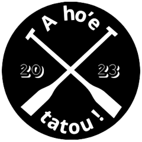

#A hoe tatou - Organize your Va'a team management
  
**@author :** Vaanaiki BROTHERSON aka Naiki  
**@date :** September 2023
###Links
**@github :** https://github.com/naikibro/a-hoe-tatou  
**@LinkedIn :** www.linkedin.com/in/naiki-brotherson987

##Synopsis
This app made with Laravel intends to help Va'a team trainers to manage their workflow  
The goal is to offer a solution to speed up organisation so that teams and trainers can focus less on organisation and more on winning races

##Product owner
This app has been ordered by the CNAM PF in the scope of the NFE114 course as an educational project

##Technical specifications and documentation
Specifications have been described in the [specifications.md ](DOC/specifications.md) file 

For more technical and precise aspects, please refer to the [documentation.md](DOC/documentation.md) file

###Big thanks to all contributors !