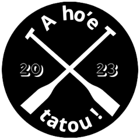
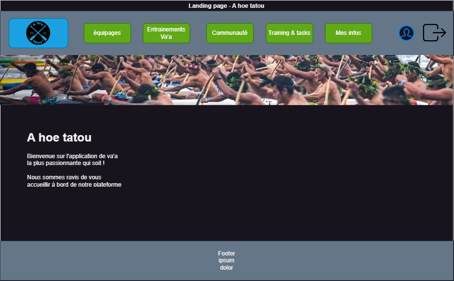
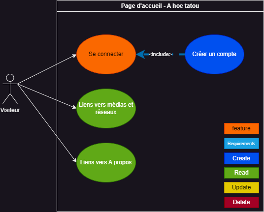
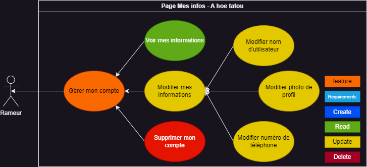
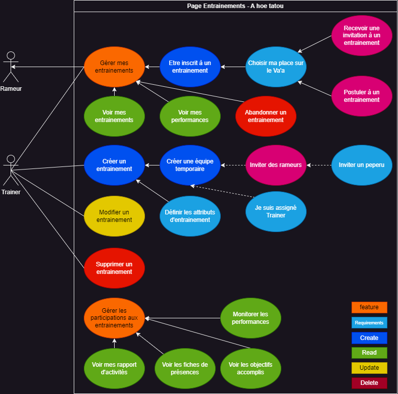
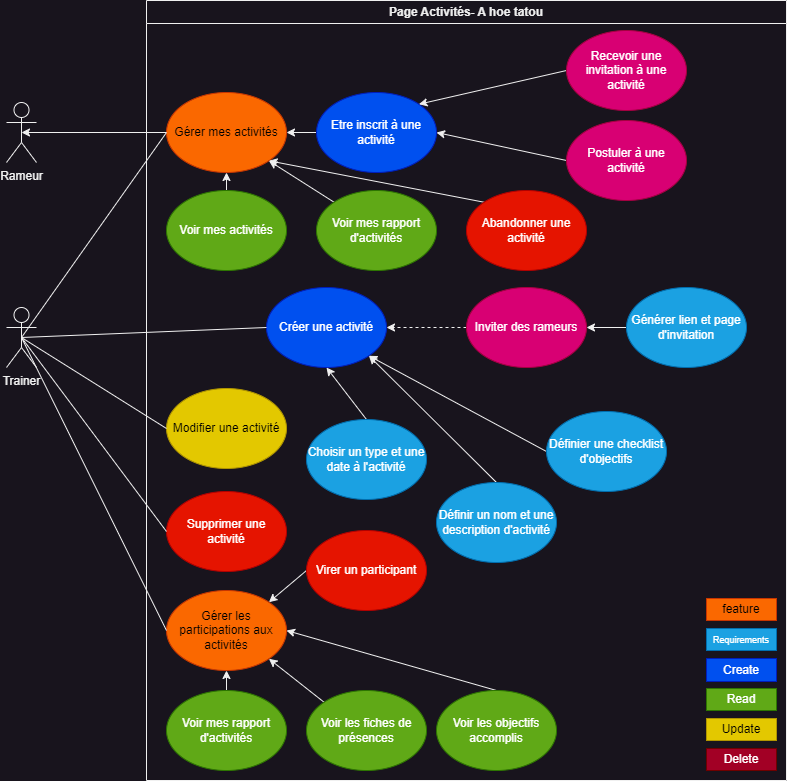
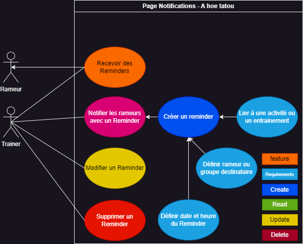
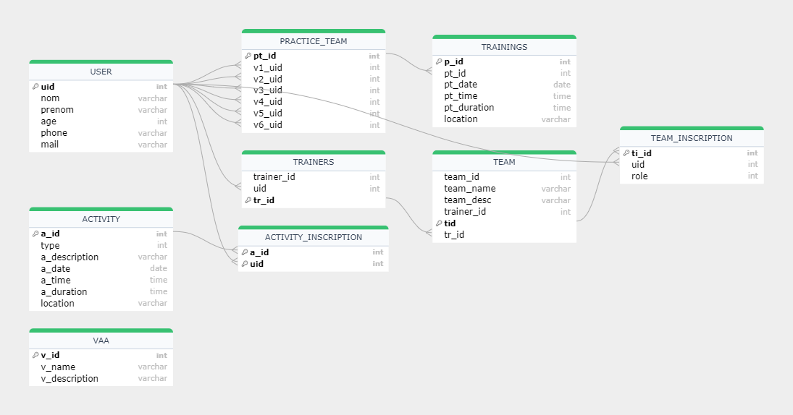

# Project L3 - Proof of Concept - Documentation

## Va'a Training Tracking Application - A Hoe Tatou
**Client: Va'a Team Coach**  
**Delivery Date:** UNDETERMINED  
**@author :** Vaanaiki BROTHERSON aka Naiki  
**@date :** September 2023
### Links
**@github :** https://github.com/naikibro/a-hoe-tatou  
**@LinkedIn :** www.linkedin.com/in/naiki-brotherson987

***
# Table of content  
This file is the functional and technical documentation for the __A hoe tatout__ project  
You will find here the Table of content of the differents parts of this project :  
* [Concepts, Methods & Implemented Technologies](#concepts-methods--implemented-technologies)
* [Mockups](#mockups)
* [Roles definitions](#roles-definition)
* [User stories and use case diagrams](#user-stories-and-use-case-diagrams)
* [Database](#database)

***
## Concepts, Methods & Implemented Technologies
__Project Management__
Project management will be done using Jira.

Track the project's progress:  
[https://naikibro.atlassian.net/jira/software/projects/HT/boards/2](https://naikibro.atlassian.net/jira/software/projects/HT/boards/2)

__Tools, Concepts, and Frameworks__
* Laravel PHP 8.1.2-1ubuntu2.14 (CLI): [Laravel Documentation](https://laravel.com/docs/10.x/installation#getting-started-on-windows)
* Model-View-Controller (MVC): [Introduction to Laravel and MVC Framework](https://www.geeksforgeeks.org/introduction-to-laravel-and-mvc-framework/)
* Docker: [Docker Installation](https://docs.docker.com/engine/install/)
* Composer: [Composer Download](https://getcomposer.org/download/)
* MariaDB Server: [MariaDB Documentation](https://mariadb.org/documentation/)
* SQL: [SQL on Wikipedia](https://en.wikipedia.org/wiki/SQL)
***  
## Mockups  
__Visiteur-landing-page__  

__Rower-landing-page__  
  

__Rower-landing-page-mobile__  
  

__User-loading-screen-animation__  
TO DO : Prepare loading screen animation made with Processing  
***
## Roles Definition  
### Passive Users  
* __Visitor__:
  * Does not have an account.
  * Is not logged in.
  * Is always redirected to a registration + login page.

* __Unregistered Rower__:
  * Has an account.
  * Is not registered in any team.

### Active Users
* __Registered Rower__:
  * Has an account.
  * Is registered in at least one crew and/or team.

* __Trainer__:
  * Has an account.
  * Is registered in at least one crew and/or team.
  * Is registered in the trainers' registry.

> **CAUTION!**: A user can be both a Rower and a Trainer for multiple crews (roles are specific to crews).

***
# User stories and use case diagrams
cf Jira board : https://naikibro.atlassian.net/jira/software/projects/HT/boards/2  
User stories are dissecated into Jira cards
You will find here all of the user stories of our app
### Visiteur
  
__USV1 - LandingPage__    
__USV2 - CreateAccount__  
__USV3 - Login__  

### Rower
  
__USR1 - Login__  
__USR2 - ModifyAccount__  
__USR3 - RemoveAccount__  

### Teams
  
  
__USRT1 - GetTeam__  
__USRT2 - CreateTeam__  
__USRT3 - ModifyTeam__  
__USRT4 - LeaveTeam__  
__USTT1 - RemoveTeam__  

__USRT5 - SendMessageToGroupChat__  
__USRT6 - SendMessageToGroupChat__  

### Teams Inscriptions
__USST1 - addUserToTeam__  
__USST2 - RemoveUserFromTeam__  

### Trainings  

__USTTr1 - GetTraining__  
__USTTr2 - CreateTraining__  
__USTTr3 - ModifyTraining__  
__USTTr4 - RemoveTraining__  

__USRTr1 - GetTraining__  
__USRTr2 - InviteRower__  
 
__USRTr3 - EnrollForTraining__  
__USRTr4 - AbandonTraining__  
__USRTr5 - ChoosePosition__  

__USSTr1 - GetPerformance__  

### Activities  

__user-story:Trainer - GetActivity__  
__user-story:Trainer - SetActivity__  
__user-story:Trainer - ModifyActivity__  
__user-story:Trainer - RemoveActivity__  

__user-story:Rower - GetActivity__  

__user-story:Rower - EnrollForActivity__  
__user-story:Rower - AbandonActivity__  

### Reminders

__user-story:Trainer - GetReminder__  
__user-story:Trainer - SetReminder__  
__user-story:Trainer - ModifyReminder__  
__user-story:Trainer - RemoveReminder__  

__user-story:Rower - GetReminder__

### Practice Team
__user-story:Trainer - GetPracticeTeams__  
__user-story:Trainer - AddPracticeTeams__   
__user-story:Trainer - ModifyPracticeTeams__  
__user-story:Trainer - RemovePracticeTeams__  

__user-story:Trainer - AlertBenchers__  
__user-story:Trainer - AddRower__  
__user-story:Trainer - InviteRower__  

__user-story:User - GetPracticeTeams__  

### System
__user-story:User - TurnOnNotifications__  
__user-story:User - TurnOffNotifications__  

__user-story:Practice - AutoFillVaa__  
__user-story:Practice - EmergencyAutoFillVaa__  

***
# Database 
__DBMS : MariaDB__
__Query language : SQL__

*Diagram made with the tool __SQL flow by GuDu__*

